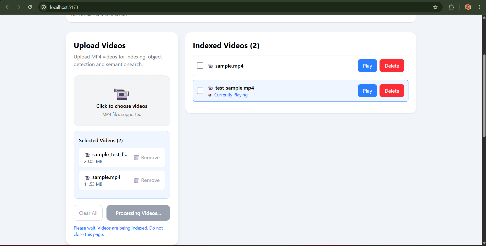
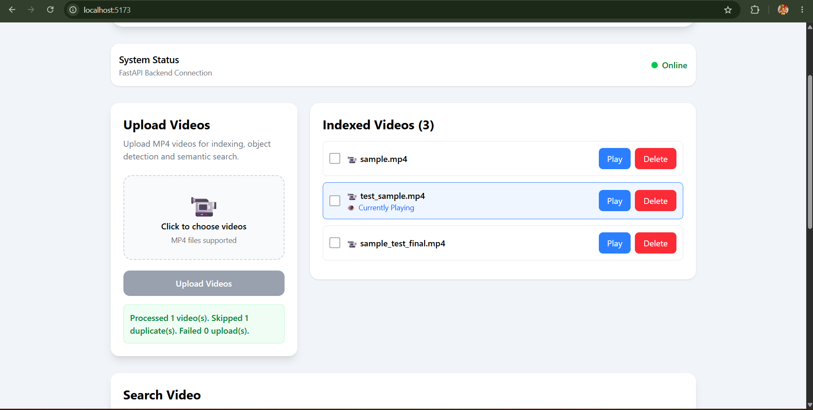
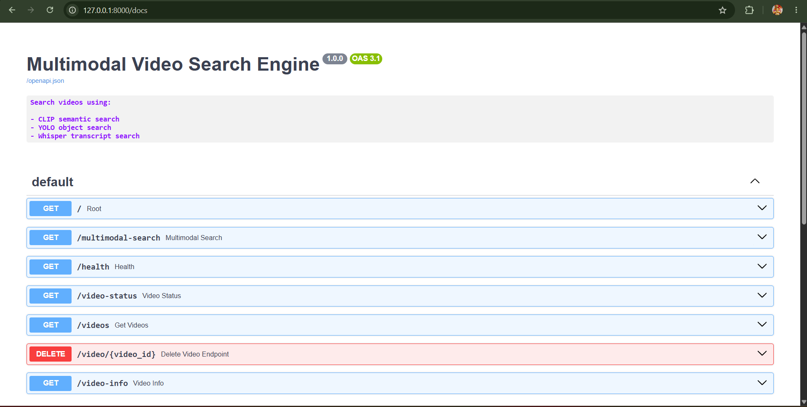
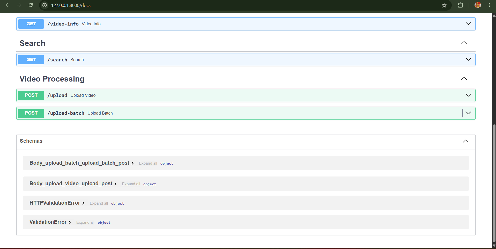

# Multimodal Video Search Engine

A scalable AI-powered video retrieval system that enables semantic, object-based, and speech-based search across multiple videos.

The system combines OpenAI CLIP, YOLOv8, Whisper, and FAISS to build an incremental multimodal index, allowing users to upload, search, preview, and manage video collections while navigating directly to relevant moments through an interactive interface.
---

## Features

### Semantic Search

Uses OpenAI CLIP embeddings and FAISS indexing to retrieve visually similar frames from natural language queries.

Example:

> "person using a laptop"

---

### Object Search

Uses YOLOv8 object detection to search frames containing detected objects.

Example:

> "person"

> "car"

> "chair"

---

### Speech Search

Uses OpenAI Whisper transcription to search spoken content.

Example:

> "machine learning"

> "artificial intelligence"

---

### Multimodal Fusion

Results from:

- CLIP
- YOLO
- Whisper

are fused into unified moments using:

- Temporal clustering
- Weighted Confidence Scoring
- Evidence aggregation
- Result Ranking

---

### Multi-Video Search

Search across one or more selected videos simultaneously.

- Select individual or multiple videos
- Scope retrieval to chosen videos
- Automatic video switching when navigating to results

### Batch Video Upload

Upload and process multiple videos in a single operation.

- Multi-file upload
- Duplicate detection
- Processing summary
- Automatic library refresh

### Incremental Indexing

New videos are indexed without rebuilding the existing FAISS index.

Features:

- Incremental CLIP embedding insertion
- Stable vector IDs using FAISS IndexIDMap2
- Metadata synchronization
- Faster indexing for large collections

### Video Lifecycle Management

Manage indexed videos directly from the application.

- Delete indexed videos
- Remove extracted frames
- Remove transcripts
- Remove audio files
- Remove metadata
- Remove FAISS vectors

### Interactive Video Navigation

- Thumbnail-based search results
- Confidence indicators
- Jump to timestamp
- Automatic video playback
- Smooth scrolling

---

## Screenshots

### Home Page

Upload videos, monitor system status, and access the search interface.


---

### Batch Upload

Upload and process videos in batch, it automatically skips duplicate video processing.




### Video Preview

Preview uploaded videos before and after processing.


---

### Search Results

Multimodal retrieval results with confidence scores, evidence sources, thumbnails, and timestamps.


---

### Jump To Moment

Navigate directly to relevant video moments with automatic playback and smooth scrolling.


---

### FastAPI Swagger Documentation

Interactive API documentation generated by FastAPI.




---

## Demo Workflow

1. Upload one or more videos.
2. Videos are processed through the multimodal indexing pipeline.
3. Select one or more videos to search.
4. Enter a natural language, object, or speech query.
5. Review ranked multimodal results.
6. Jump directly to the relevant moment.
7. Delete videos when no longer needed.

## Architecture

                 React + Vite
                        │
        ┌───────────────┴───────────────┐
        │                               │
 Batch Video Upload               Search Query
        │                               │
        ▼                               ▼
      FastAPI                  Selected Video Scope
        │                               │
        ▼                               ▼
 ┌────────────────────────────────────────────┐
 │        Video Processing Pipeline           │
 │                                            │
 │  Frame Extraction                          │
 │        │                                   │
 │  CLIP Embeddings                           │
 │        │                                   │
 │  Incremental FAISS Index                   │
 │        │                                   │
 │  YOLO Detection                            │
 │        │                                   │
 │  Audio Extraction                          │
 │        │                                   │
 │  Whisper Transcription                     │
 └────────────────────────────────────────────┘
                    │
                    ▼
        Multimodal Fusion Engine
                    │
                    ▼
            Ranked Search Results
                    │
                    ▼
        Interactive Video Navigation

---

## Design Decisions

- CLIP provides open-vocabulary semantic retrieval without predefined classes.
- YOLO complements semantic search through explicit object detection.
- Whisper enables natural language transcript retrieval.
- FAISS provides efficient vector similarity search.
- IndexIDMap2 enables stable vector identifiers for incremental indexing and deletion.
- Temporal clustering combines evidence from multiple modalities into unified search moments.

## REST API

| Endpoint | Description |
|----------|-------------|
| POST /upload | Upload a single video |
| POST /upload-batch | Upload multiple videos |
| GET /videos | Retrieve indexed videos |
| DELETE /video/{video_id} | Delete an indexed video |
| GET /multimodal-search | Multimodal search |
| GET /health | Health check |
| GET /video-info | Index statistics |

## Scalability

The system supports incremental indexing, allowing newly uploaded videos to be added without rebuilding the complete FAISS index.

Deletion operations remove vectors, metadata, transcripts, audio, and extracted frames while maintaining index consistency through FAISS IndexIDMap2.

## Tech Stack

### Backend

- FastAPI
- PyTorch
- Transformers
- FAISS
- OpenCV
- YOLOv8
- Whisper

### Frontend

- React
- TypeScript
- Tailwind CSS
- Axios
- Vite

---

## Project Structure

```text
backend/
├── app.py
├── models/
├── services/
├── tests/
└── scripts/

frontend/
├── src/
│   ├── components/
│   ├── pages/
│   ├── api/
│   └── types/

docs/
.gitignore
requirements.txt
requirements_freeze.txt
README.md
```

---

## Installation

### Backend

```bash
pip install -r requirements.txt
```

Start API:

```bash
uvicorn backend.app:app --reload
```

---

### Frontend

```bash
cd frontend

npm install

npm run dev
```

---

## First Run

Create the required directories:

```bash
mkdir frames
mkdir indexes
mkdir transcripts
mkdir videos
```

Download the YOLO model:

```bash
yolo detect predict model=yolov8s.pt
```

or download `yolov8s.pt` from the Ultralytics release page and place it in the project root.

Then start the backend:

```bash
uvicorn backend.app:app --reload
```
---

## Future Improvements

- Background task processing (Celery/RQ)
- AWS S3 video storage
- PostgreSQL Metadata Storage
- Qdrant Vector Database Integration
- Real-time Video Indexing
- Video Summarization
- Conversational Video Search
- GPU acceleration
- Query caching
- Cloud Deployment

## Disclaimer

This project is developed solely for academic, educational, and research purposes.

Any third-party videos, images, or media used during testing remain the property of their respective copyright owners. The project does not claim ownership of such content and is not intended for commercial use.

All screenshots and demonstrations are provided only to showcase the functionality of the system.
