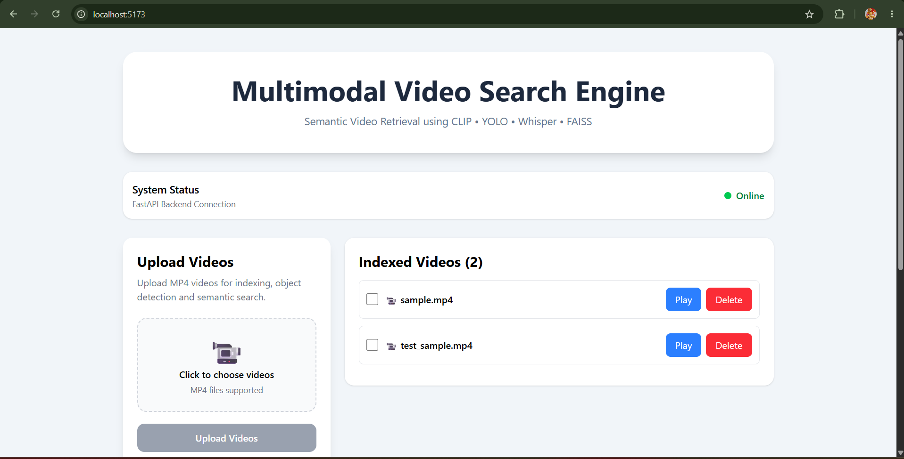
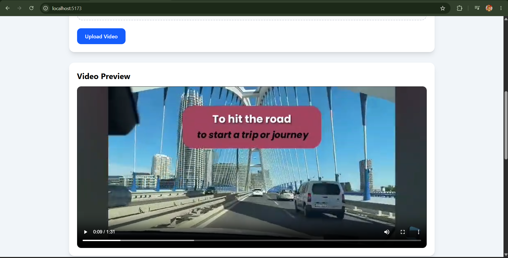
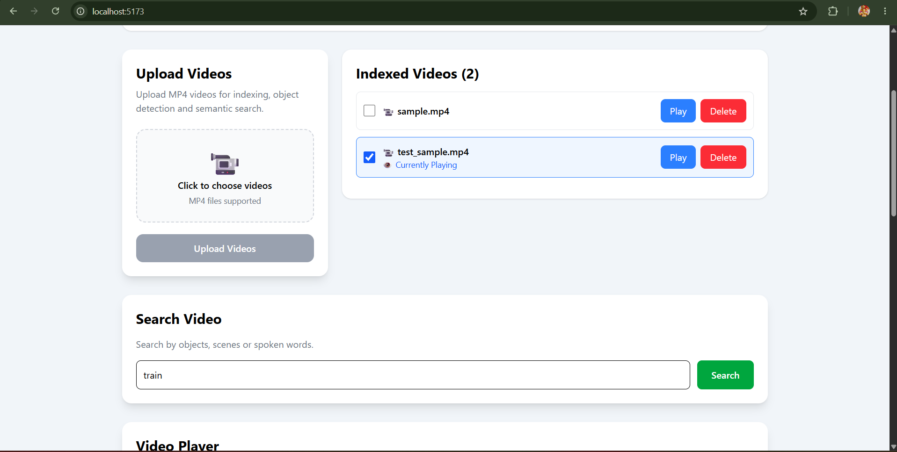
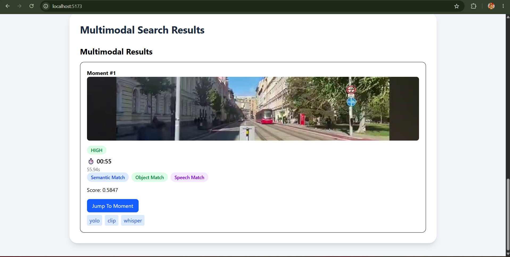
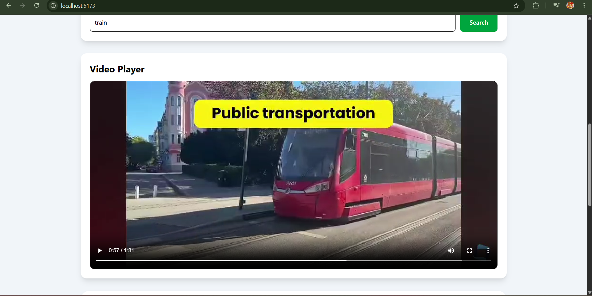
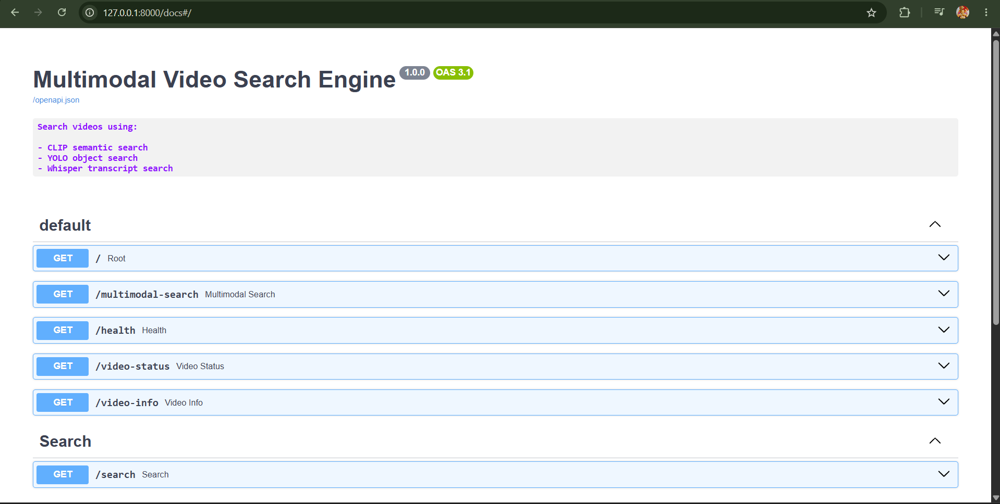

# Multimodal Video Search Engine

An AI-powered video retrieval system that enables semantic, visual, and speech-based search across video content.

The system combines CLIP, YOLOv8, Whisper, and FAISS to identify relevant moments in a video and allows users to instantly navigate to the most relevant timestamps through an interactive interface.
---

## Features

### Semantic Search

Uses OpenAI CLIP embeddings and FAISS indexing to retrieve visually similar frames from natural language queries.

Example:

> "person using a laptop"

---

### Object Search

Uses YOLOv8 object detection to search frames containing detected objects.

Example:

> "person"

> "car"

> "chair"

---

### Speech Search

Uses OpenAI Whisper transcription to search spoken content.

Example:

> "machine learning"

> "artificial intelligence"

---

### Multimodal Fusion

Results from:

- CLIP
- YOLO
- Whisper

are fused into unified moments using:

- Temporal clustering
- Weighted Confidence Scoring
- Evidence aggregation
- Result Ranking

---

### Interactive Video Navigation

- Thumbnail-based search results
- Confidence indicators
- Jump to timestamp
- Automatic video playback
- Smooth scrolling

---

## Screenshots

### Home Page

Upload videos, monitor system status, and access the search interface.



---

### Video Preview

Preview uploaded videos before and after processing.



---

### Search Results

Multimodal retrieval results with confidence scores, evidence sources, thumbnails, and timestamps.



---

### Jump To Moment

Navigate directly to relevant video moments with automatic playback and smooth scrolling.



---

### FastAPI Swagger Documentation

Interactive API documentation generated by FastAPI.



---

## Architecture

```text
Video Upload
      │
      ▼
Video Processing Pipeline
      │
 ┌────┼────┐
 ▼    ▼    ▼
CLIP YOLO Whisper
 │    │     │
 └────┼─────┘
      ▼
Fusion Engine
      ▼
Unified Moments
      ▼
Frontend Results
      ▼
Jump To Moment
```

---

## Tech Stack

### Backend

- FastAPI
- PyTorch
- Transformers
- FAISS
- OpenCV
- YOLOv8
- Whisper

### Frontend

- React
- TypeScript
- Tailwind CSS
- Axios
- Vite

---

## Project Structure

```text
backend/
├── app.py
├── models/
├── services/
├── tests/
└── scripts/

frontend/
├── src/
│   ├── components/
│   ├── pages/
│   ├── api/
│   └── types/

docs/
.gitignore
requirements.txt
requirements_freeze.txt
README.md
```

---

## Installation

### Backend

```bash
pip install -r requirements.txt
```

Start API:

```bash
uvicorn backend.app:app --reload
```

---

### Frontend

```bash
cd frontend

npm install

npm run dev
```

---

## First Run

Create the required directories:

```bash
mkdir frames
mkdir indexes
mkdir transcripts
mkdir videos
```

Download the YOLO model:

```bash
yolo detect predict model=yolov8s.pt
```

or download `yolov8s.pt` from the Ultralytics release page and place it in the project root.

Then start the backend:

```bash
uvicorn backend.app:app --reload
```
---

## Future Improvements

- Agentic AI Query Planning
- PostgreSQL Metadata Storage
- Qdrant Vector Database Integration
- Real-time Video Indexing
- Multi-video Collections
- Video Summarization
- Conversational Video Search
- Cloud Deployment

## Disclaimer

This project is developed solely for academic, educational, and research purposes.

Any third-party videos, images, or media used during testing remain the property of their respective copyright owners. The project does not claim ownership of such content and is not intended for commercial use.

All screenshots and demonstrations are provided only to showcase the functionality of the system.
